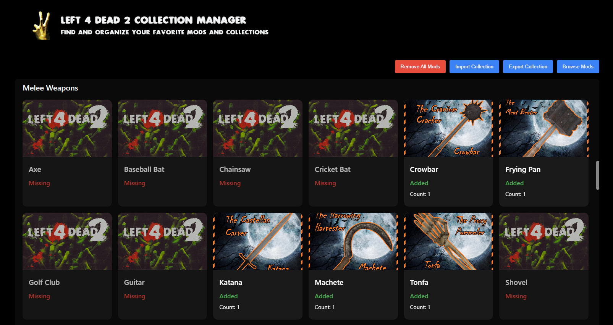

# Left 4 Dead 2 Workshop Collection Manager

A tool for organizing and managing Left 4 Dead 2 mod collections on the Steam workshop, using an intuitive web interface. Most useful for seeing what types of mods are missing from your collection



## Building

### Project Structure

- **Scripts** (`script.py`): Runs daily to fetch new L4D2 Workshop data from the past 48 hours and upload it to the Supabase PostgreSQL database
- **Frontend** (`website/`): Runs the frontend React application
- **Backend** (`db/`): Node.js API server that connects to the Supabase database and exposes endpoints for the frontend

### Prerequisites

- Node.js (v16 or higher)
- Supabase
- Python 3.7+ (for data fetching)

### Installation

1. **Clone and install dependencies:**

   ```bash
   git clone https://github.com/JahsiasWhite/LFD2-workshop-collection-manager
   cd LFD2-manager
   npm run install:all
   ```

2. **Set up environment variables:**

   ```bash
   # Supbase configuration
   # Used by the backend to load the database and used by the script to upload data
   SUPABASE_URL=
   SUPABASE_KEY=

   # For downloading the workshop data from Steam
   STEAM_API_KEY=

   # For the React frontend to connect to the backend API
   REACT_APP_API_URL=http://localhost:3000/api/db # Assuming backend is running locally on port 3000

   # Used by the backend server to connect to the frontend
   ALLOWED_ORIGINS=http://localhost:3001 # Assuming frontend is running locally on port 3001
   ```

3. **Fetch mod data (optional):**

   ```bash
   # Run the Python script to fetch latest mod data and upload it into the database
   python script.py
   ```

4. **Start the application:**

   ```bash
   npm run start:backend  # Backend only
   npm run start:frontend # Frontend only
   ```

## Available Scripts

### Root Level

- `npm start` - Start backend server
- `npm run build` - Build frontend for production
- `npm run install:all` - Install all dependencies
- `python script.py` - Installs and uploads workshop data into the database

### Backend (`db/`)

- `npm run start:backend` - Start Express server
- `npm run dev` - Start with nodemon for development

### Frontend (`website/`)

- `npm run start:frontend` - Start React development server
- `npm run build:frontend` - Build for production
